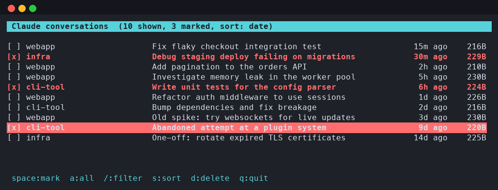

# claude-cleaner

A small terminal tool to list and delete Claude Code conversations — the
sessions shown by the `/resume` command. Claude Code has no built-in way to
clean these up, so this fills the gap with an interactive checklist UI.

It scans `~/.claude/projects/*/*.jsonl` across all your projects, shows each
conversation's project, title, last-modified time, and disk size, and lets
you mark any number of them for deletion before confirming.

Pure Python standard library — no dependencies, no install step.



## Usage

```
./claude_cleaner.py [--claude-dir PATH] [--dry-run]
```

- `--claude-dir PATH` — path to the Claude Code config dir (default: `~/.claude`)
- `--dry-run` — show what would be deleted without deleting anything
- `--version` — print the version and exit

## Keys

| Key           | Action                                            |
|---------------|----------------------------------------------------|
| `up`/`down`, `j`/`k` | move cursor                                |
| `space`       | toggle mark on the current row                     |
| `a`           | toggle mark on all currently visible rows          |
| `/`           | filter by project or title (Enter to apply, Esc to clear) |
| `s`           | cycle sort: date added → a-z → z-a                 |
| `d`, `enter`  | delete marked conversations (asks for confirmation)|
| `q`           | quit without changing anything                     |

Marked conversations are highlighted in red; the confirmation dialog shows
the total count and disk space that will be freed.

## What gets deleted

For each marked conversation, its `.jsonl` session file is removed, along
with any companion directory of the same session ID (e.g. stored tool
results). Nothing else under `~/.claude` is touched — per-project agent
memory and `~/.claude.json` are left alone.
